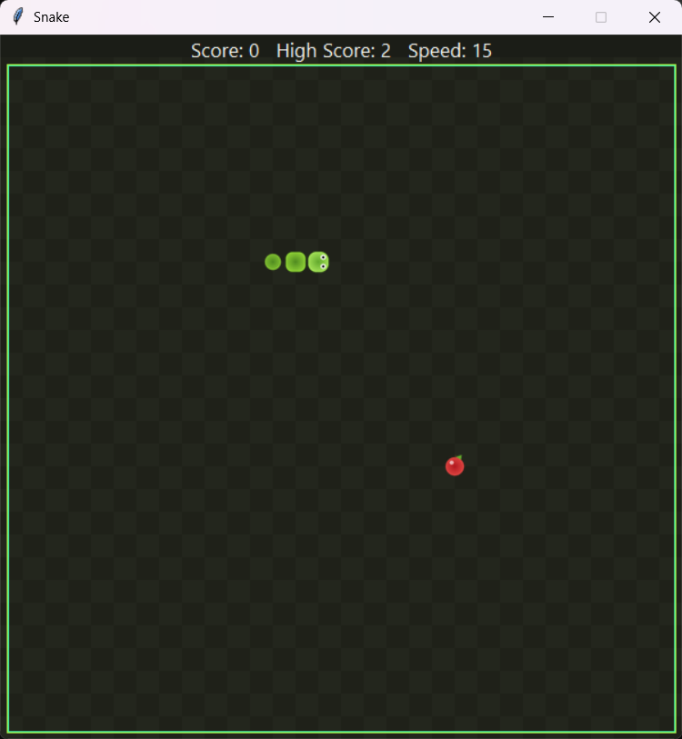

# Snake

A modern take on the classic Snake game, built from scratch in Python with Tkinter — smooth rounded rendering, procedurally generated sprites, a persistent high score, and a game loop backed by a fully unit-tested rules engine.

[](https://github.com/Hqasim/Snake-Game/actions/workflows/ci.yml)




## Features

- **Smooth, modern visuals** — rounded, gradient-shaded snake segments with a direction-aware head (eyes always face the way you're moving), a shiny gradient apple, and a subtle checkerboard playfield. No PyCharm, no flat colored squares.
- **Progressive difficulty** — the snake speeds up every 5 points.
- **Persistent high score** — your best run is saved locally and shown on the start screen and HUD.
- **Pause / resume** — `P` freezes the game loop mid-run.
- **Start menu & game-over screen** — with score, high score, and a "New High Score!" callout.
- **Unit-tested rules engine** — collision detection, movement, food placement, and scoring are pure functions with no Tkinter dependency, covered by `pytest`.
- **CI on every push** — GitHub Actions runs the lint + test suite across two Python versions.

## Tech Stack

Python · Tkinter (GUI) · Pillow (sprite generation & rendering) · Pytest · Ruff · GitHub Actions

## Getting Started

No IDE required — just Python and a terminal.

```bash
# 1. Clone the repository
git clone https://github.com/Hqasim/Snake-Game.git
cd Snake-Game

# 2. Create and activate a virtual environment
python -m venv .venv
.venv\Scripts\activate      # Windows
source .venv/bin/activate   # macOS / Linux

# 3. Install dependencies
pip install -r requirements.txt

# 4. Run the game
python -m snake_game
```

**Requirements:** Python 3.10+ (Tkinter ships with the standard Windows/macOS installers; on Linux install it separately if needed, e.g. `sudo apt install python3-tk`).

## Controls

| Key                 | Action                          |
| -------------------- | -------------------------------- |
| Arrow keys            | Move the snake                  |
| `P`                   | Pause / resume                  |
| `Space`                | Start the game / play again     |

## Project Structure

```
Snake-Game/
├── snake_game/            # The game package
│   ├── __main__.py        # Entry point (python -m snake_game)
│   ├── config.py          # Board geometry, colors, timing constants
│   ├── logic.py           # Pure game rules (movement, collisions, scoring) — no Tkinter
│   ├── persistence.py     # High score load/save
│   └── ui.py               # Tkinter canvas: rendering + input + game loop
├── tools/
│   └── generate_assets.py # Procedurally generates the sprite PNGs with Pillow
├── assets/
│   ├── sprites/             # Generated snake/food sprites (source of truth: the script above)
│   └── screenshots/         # README images
├── tests/                  # Pytest suite for snake_game.logic and snake_game.persistence
└── .github/workflows/ci.yml
```

## Development

```bash
pip install -r requirements-dev.txt

pytest -q          # run the test suite
ruff check .        # lint
```

## Regenerating the Assets

The sprites aren't hand-drawn files — they're generated by a script that draws rounded gradient shapes at 4x resolution and downsamples them for anti-aliased edges:

```bash
python tools/generate_assets.py
```

Edit the colors/shapes in `tools/generate_assets.py` and re-run it to restyle the whole game.

## Roadmap

- [ ] Sound effects
- [ ] Selectable difficulty / board size
- [ ] Local leaderboard (top N runs, not just the single high score)

## License

Distributed under the [MIT License](LICENSE).

## Author

**Hamzah Qasim** — [github.com/Hqasim](https://github.com/Hqasim)
